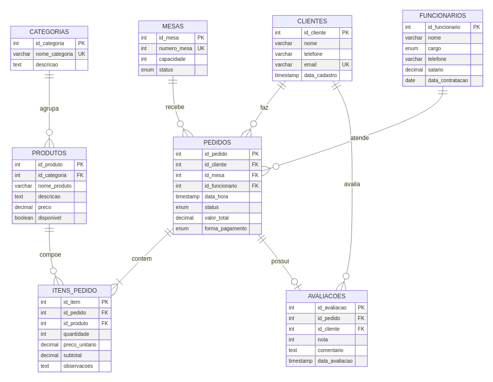

# Sistema de Gerenciamento de Restaurante - Banco de Dados SQL



## 1. Visão Geral do Projeto

Este projeto consiste em um banco de dados relacional completo para um **Sistema de Gerenciamento de Restaurante**. Ele foi projetado para ser uma peça de portfólio robusta, demonstrando proficiência em design de banco de dados, normalização, e escrita de consultas SQL complexas. A estrutura é realista, escalável e resolve problemas práticos do dia a dia de um restaurante, desde o gerenciamento de pedidos e mesas até a análise de performance de vendas e funcionários.

## 2. Objetivo e Problema Resolvido

O principal objetivo é centralizar e organizar todas as operações de um restaurante em um único sistema de dados coeso e eficiente. Ele resolve os seguintes desafios:

- **Controle de Pedidos:** Gerencia o ciclo de vida completo de um pedido, desde a abertura até o pagamento.
- **Gestão de Mesas:** Otimiza a utilização das mesas, controlando seus status (disponível, ocupada, reservada).
- **Análise de Vendas:** Fornece insights sobre faturamento, produtos mais vendidos, horários de pico e desempenho dos garçons.
- **Relacionamento com o Cliente:** Mantém um cadastro de clientes para futuras ações de marketing e análise de consumo.
- **Gestão de Cardápio:** Organiza produtos em categorias e controla a disponibilidade.

## 3. Tecnologias Utilizadas

- **SGBD:** MySQL 8.0
- **Linguagem:** SQL (DDL, DML, DQL)
- **Diagramas:** Mermaid (renderizado para PNG)
- **Documentação:** Markdown

## 4. Estrutura do Banco de Dados

O banco de dados foi projetado seguindo as melhores práticas de modelagem relacional e está na **Terceira Forma Normal (3FN)** para garantir a integridade e minimizar a redundância dos dados.

### Entidades Principais

| Entidade | Descrição |
| :--- | :--- |
| `CLIENTES` | Armazena informações dos clientes do restaurante. |
| `MESAS` | Gerencia as mesas do estabelecimento, incluindo capacidade e status. |
| `FUNCIONARIOS` | Mantém registros dos funcionários, como cargo e dados de contratação. |
| `CATEGORIAS` | Agrupa os produtos do cardápio (ex: Entradas, Pratos Principais). |
| `PRODUTOS` | Detalha cada item do cardápio, incluindo preço e disponibilidade. |
| `PEDIDOS` | Tabela central que registra cada pedido feito, associando cliente, mesa e garçom. |
| `ITENS_PEDIDO` | Tabela associativa que detalha os produtos de cada pedido. |
| `AVALIACOES` | Permite que clientes avaliem os pedidos, fornecendo feedback valioso. |

### Diagrama Entidade-Relacionamento (DER)

O diagrama abaixo ilustra as entidades e seus relacionamentos:


## 5. Scripts SQL

O projeto está organizado em múltiplos scripts SQL para facilitar a manutenção e a execução.

- **`01_create_database.sql`**: Cria o banco de dados `restaurante_db` e todas as tabelas, definindo chaves primárias, estrangeiras, índices e constraints.
- **`02_insert_data.sql`**: Popula o banco com dados de exemplo realistas para permitir a execução de consultas e testes.
- **`03_triggers_procedures.sql`**: Contém a lógica de negócio automatizada, como triggers para atualizar o valor total de um pedido e stored procedures para operações complexas (ex: finalizar pedido, gerar relatórios).
- **`04_views_queries.sql`**: Define views para simplificar consultas comuns e apresenta uma série de consultas analíticas avançadas.
- **`05_indexes.sql`**: Cria índices adicionais para otimizar a performance de consultas específicas.

## 6. Exemplos de Consultas SQL

Abaixo estão alguns exemplos de consultas complexas presentes no arquivo `04_views_queries.sql`, que demonstram a capacidade analítica do banco de dados.

### Consulta: Top 5 Clientes Mais Valiosos

```sql
-- Identifica os clientes que mais gastaram para estratégias de fidelização
SELECT 
    c.id_cliente,
    c.nome,
    c.email,
    COUNT(p.id_pedido) AS total_pedidos,
    SUM(p.valor_total) AS valor_total_gasto
FROM clientes c
INNER JOIN pedidos p ON c.id_cliente = p.id_cliente
WHERE p.status = 'finalizado'
GROUP BY c.id_cliente, c.nome, c.email
ORDER BY valor_total_gasto DESC
LIMIT 5;
```

### Consulta: Produtos Mais Vendidos

```sql
-- Análise de performance de produtos para gestão de estoque e cardápio
SELECT 
    p.nome_produto,
    c.nome_categoria,
    SUM(ip.quantidade) AS quantidade_vendida,
    SUM(ip.subtotal) AS receita_total
FROM itens_pedido ip
INNER JOIN produtos p ON ip.id_produto = p.id_produto
INNER JOIN categorias c ON p.id_categoria = c.id_categoria
INNER JOIN pedidos ped ON ip.id_pedido = ped.id_pedido
WHERE ped.status = 'finalizado'
GROUP BY p.id_produto, p.nome_produto, c.nome_categoria
ORDER BY quantidade_vendida DESC
LIMIT 10;
```

### Consulta: Análise de Horários de Pico

```sql
-- Identifica os horários de maior movimento para otimizar a alocação de equipe
SELECT 
    HOUR(data_hora) AS hora,
    COUNT(id_pedido) AS total_pedidos,
    SUM(valor_total) AS faturamento
FROM pedidos
WHERE status = 'finalizado'
GROUP BY HOUR(data_hora)
ORDER BY total_pedidos DESC;
```

## 7. Como Executar Localmente

Para configurar e rodar este projeto em seu ambiente local, siga os passos abaixo.

### Pré-requisitos

- **MySQL Server:** Certifique-se de ter o MySQL (versão 8.0 ou superior) instalado e em execução.
- **Cliente MySQL:** Um cliente de linha de comando (como o `mysql`) ou uma ferramenta de interface gráfica (como DBeaver, MySQL Workbench, etc.).

### Passos para Instalação

1.  **Clone o Repositório:**

    ```bash
    git clone <URL_DO_SEU_REPOSITORIO_NO_GITHUB>
    cd restaurante-sql-project
    ```

2.  **Acesse o Cliente MySQL:**

    Abra seu terminal ou cliente MySQL e conecte-se ao servidor com um usuário que tenha permissão para criar bancos de dados (como o `root`):

    ```bash
    mysql -u root -p
    ```

3.  **Execute os Scripts SQL:**

    Execute os scripts na ordem correta para criar a estrutura, inserir os dados e definir as funcionalidades avançadas. Utilize o comando `SOURCE` dentro do cliente MySQL.

    ```sql
    -- 1. Criar o banco e as tabelas
    SOURCE /caminho/para/o/projeto/sql/01_create_database.sql;

    -- 2. Inserir os dados de exemplo
    SOURCE /caminho/para/o/projeto/sql/02_insert_data.sql;

    -- 3. Criar triggers e procedures
    SOURCE /caminho/para/o/projeto/sql/03_triggers_procedures.sql;

    -- 4. Criar views e executar consultas
    SOURCE /caminho/para/o/projeto/sql/04_views_queries.sql;

    -- 5. Adicionar índices de otimização
    SOURCE /caminho/para/o/projeto/sql/05_indexes.sql;
    ```

4.  **Verifique a Instalação:**

    Após executar todos os scripts, você pode verificar se tudo foi criado corretamente.

    ```sql
    USE restaurante_db;
    SHOW TABLES;

    -- Teste uma das views
    SELECT * FROM vw_pedidos_completos LIMIT 10;

    -- Teste uma das procedures
    CALL produtos_mais_vendidos(5);
    ```

## 8. Estrutura de Arquivos do Projeto

```
.restaurant-management-system/
├── diagrams/
│   ├── database_diagram.mmd      # Código Mermaid do diagrama
│   └── database_diagram.png      # Imagem do diagrama ER
├── docs/
│   └── database_design.md        # Documentação do design do banco
├── sql/
│   ├── 01_create_database.sql    # DDL: Criação do banco e tabelas
│   ├── 02_insert_data.sql        # DML: Inserção de dados
│   ├── 03_triggers_procedures.sql # Triggers e Stored Procedures
│   ├── 04_views_queries.sql      # Views e Consultas Analíticas
│   └── 05_indexes.sql            # Índices de otimização
└── README.md                     # Documentação principal do projeto
```

